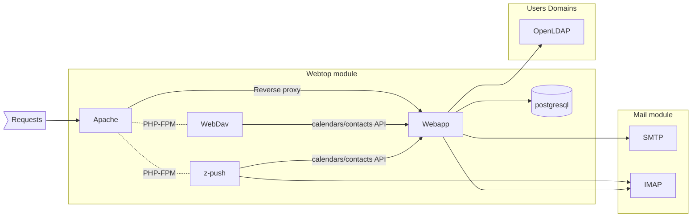

# ns8-webtop

NS8 WebTop module, a collaboration suite of services accessible via web for emails, calendars, contacts, documents.

Official website: http://www.sonicle.com/webtop

## Module overview

## Install

Instantiate the module with:

    add-module ghcr.io/nethserver/webtop:latest 1

The output of the command will return the instance name.
Output example:

    {"module_id": "webtop1", "image_name": "webtop", "image_url": "ghcr.io/nethserver/webtop:latest"}

## Uninstall

To uninstall the instance:

    remove-module --no-preserve webtop1

## Testing

Test the module using the `test-module.sh` script:

    ./test-module.sh <NODE_ADDR> ghcr.io/nethserver/webtop:latest

The tests are made using [Robot Framework](https://robotframework.org/)
